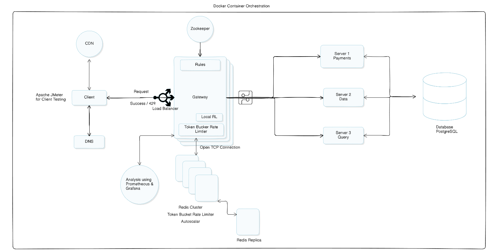
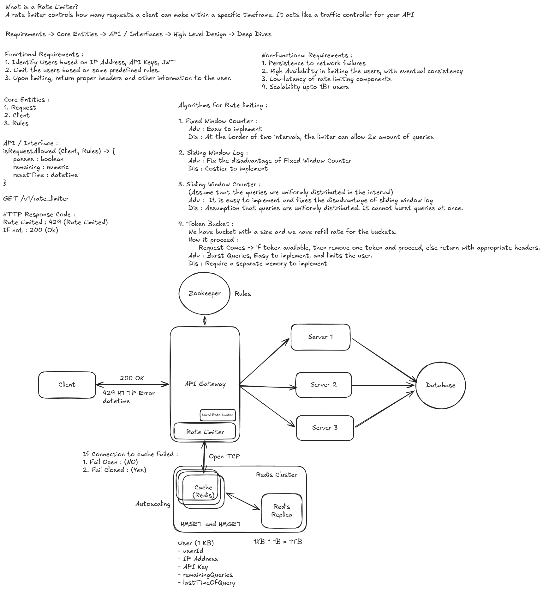

# Distributed API Gateway & Rate Limiter

Welcome! This is a high-performance, distributed API gateway built from scratch. Its main job is to sit in front of backend services, manage incoming traffic, and instantly block users who send too many requests (rate limiting). 

I built this to handle massive amounts of traffic safely, using a mix of fast languages for the heavy lifting and reliable tools for keeping data in sync across different servers.

---

## What It Does
* **Super Fast Routing:** Uses C++ to handle thousands of connections at once without blocking the main system.
* **Cluster-Wide Rate Limiting:** Uses Redis to make sure a user's request limit is counted correctly across *all* gateway servers at the exact same time.
* **Live Configuration:** Uses Apache ZooKeeper so we can change the rate limits on the fly without having to restart the servers.
* **Auto-Scaling:** A custom Python script watches the CPU usage and automatically adds more C++ gateway servers if the traffic gets too heavy.
* **Load Balancing:** HAProxy sits at the very front to pass out incoming traffic evenly to all active gateway servers.

---

## Architecture

Below is the high-level design of how all the pieces fit together. 

<div align="center">
  <a href="/assets/System_design.png" target="_blank">
    <a href="./assets/System_design.png" target="_blank">
        
    </a>
  </a>
  <p><em>Click the small image above to zoom in and see the full details.</em></p>
</div>

### The Flow of a Request:
1.  **HAProxy** receives the user's HTTP request.
2.  It sends the request to one of the active **C++ Gateway Nodes**.
3.  The Gateway checks **Redis** to see if the user has enough "tokens" left (using a Token Bucket algorithm).
4.  If Redis says "Yes", the Gateway sends the request to the **Python Backend**.
5.  If Redis says "No", the Gateway drops the connection and sends a `429 Too Many Requests` error.
6.  Meanwhile, **ZooKeeper** silently feeds the latest rules (like "allow 50 requests per second") to the Gateway.

---

## The Tech Stack

* **C++17:** The core engine. Picked because it is incredibly fast and gives tight control over memory and network connections.
* **Redis:** In-memory data store. Used specifically for its Lua scripting, which lets us count requests safely without mix-ups.
* **Apache ZooKeeper:** Keeps the "truth" of our settings. If a new C++ node boots up, it asks ZooKeeper for the current rules.
* **Python (Flask):** Used for the mock backend services and the autoscaler script. 
* **Docker & Docker Compose:** Wraps everything into neat boxes so it can run anywhere with a single command.

---

## Engineering Trade-Offs

Building a distributed system is all about making choices. Here is why we made ours:

<!-- ARCHITECTURE IMAGE 1 PLACEHOLDER -->
<div align="center">
  <a href="/assets/Tradeoff.png" target="_blank">
    <a href="./assets/Tradeoff.png" target="_blank">
        
    </a>
  </a>
  <p><em>Click the small image above to zoom in and see the full details.</em></p>
</div>

**1. Redis Lua Scripts vs. In-Memory Locks**
* *The Choice:* We use Redis Lua scripts to check and update rate limits, rather than letting the C++ nodes track it in their own memory.
* *The Trade-off:* Going over the network to Redis takes a tiny bit longer than checking local memory. However, it completely prevents "race conditions" (where two servers accidentally allow the same request) and keeps the count 100% accurate across the whole cluster.

**2. Speed vs. Downstream Bottlenecks**
* *The Choice:* The C++ gateway is built with non-blocking I/O. It can accept thousands of connections in milliseconds.
* *The Trade-off:* Our mock Python backend is slow. When traffic spikes, the gateway accepts the connections but gets stuck waiting for Python to answer. This taught us that a system is only as fast as its slowest piece, and in real life, we would need to add hard timeouts to protect the gateway's memory.

**3. Reactive vs. Predictive Autoscaling**
* *The Choice:* Our autoscaler checks CPU usage every 10 seconds. If it's high, it adds a node.
* *The Trade-off:* This is simple and works great for slow traffic build-ups. But, if a massive traffic spike hits instantly, the server might run out of memory and crash before the 10-second timer even finishes. 

---

## Benchmarks

We ran deep stress tests using `wrk` to see where the system breaks. 

### Profile A: "The Brick Wall" (Defensive Testing)
**Goal:** See how fast the gateway can block bad traffic.
**Setup:** We told ZooKeeper to only allow **5 requests**. We then blasted it with traffic.

| Concurrent Users | Throughput | Total Requests Handled (30s) | Block Rate (HTTP 429) | Avg Latency |
| :--- | :--- | :--- | :--- | :--- |
| **1,000** | 587 req/sec | 17,652 | 99.8% | 47.78ms |
| **5,000** | 37,931 req/sec | 1,141,822 | 99.99% | 27.90ms |

*Result:* The C++ engine shines here. It rejected over 1.1 million requests in 30 seconds with almost zero CPU strain. Redis kept perfect track and only let exactly 5 requests through.

### Profile B: "The Open Pipe" (Throughput Testing)
**Goal:** See how fast the gateway can route *good* traffic to the backend.
**Setup:** We opened the limit to 50,000 to let everything through to our 5 Python backend servers.

| Concurrent Users | Throughput | Total Requests (30s) | Avg Latency | System Health |
| :--- | :--- | :--- | :--- | :--- |
| **50** | 567 req/sec | 17,028 | 119.67ms | Everything smooth |
| **100** | 519 req/sec | 15,604 | 239.71ms | Backend getting saturated |
| **250** | 174 req/sec | 5,257 | 287.84ms | Backend fully deadlocked |

*Result:* The gateway easily handles the routing, but the downstream Python servers choke after 50 connections. This proves the gateway works, but the backend needs a faster language or more servers for real-world use.


## Quick Start

Want to run this on your own machine? It takes just two commands.

1.  **Set up the folders:**
    ```bash
    chmod +x setup.sh
    ./setup.sh
    ```
2.  **Boot the cluster:**
    ```bash
    docker compose up -d --build
    ```
3.  **Test the gateway:**
    ```bash
    curl http://localhost:8080/payments
    ```

---